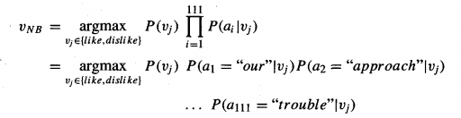
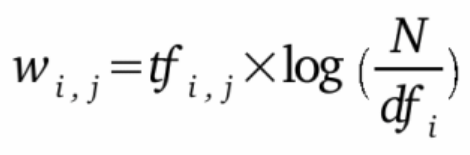

# naive_bayes_newsgroup_classifier
simple naive bayes implementation for the classic Usenet newsgroups text classification problem.
 (project for Artificial Intelligence class.)

the classifier's accuracy for the three methods tested (raw probabilities, m-estimate, and tf-idf weighted) were as follows:

10.069% --- raw 
45.842% --- m-estimate 
72.968% --- tf-idf weighted + m-estimate

The highest accuracy was achieved using both the TF-IDF weighting method and the m-estimate word probability equations.

-----

###### A few notes

the main equation used for the naive Bayes classification is:

where:

VNB is the classification that gives the maximum probability of observing the words that were actually found in the document (in this case, the newsgroup article). This is of course subject to the naive Bayes independence assumption:

> ### P(al, ... alll | vj) = *Π* P(ai | vj)

In this case, the independence assumption states that the word probabilities for any single position in the text are independent of the words that occur in other positions, given the newsgroup classification **v**j. (Obviously this assumption is incorrect, for example, there is a higher probability of the word "Bayes" occurring if the word "naive" is in the previous position.) However despite this incorrect indepence assumption, naive Bayes learners perform surprisingly well.

-----

the equation for TF-IDF (term frequency–inverse document frequency) is:

 

TF-IDF weights word frequencies (term frequencies) by how *unlikely* each word is in the newsgroup category (inverse document frequency), which often leads to improved results. For example, terms like "car" and "wheel" are more likely to appear in the newsgroup category "rec.autos" than in "rec.sport.baseball".

